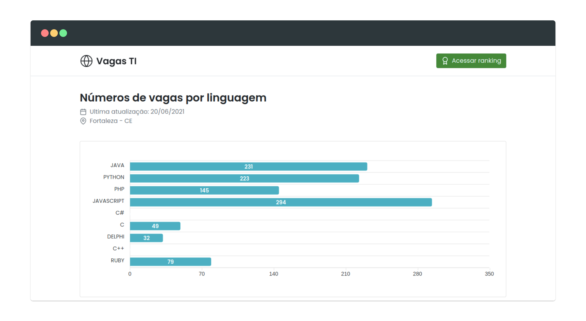
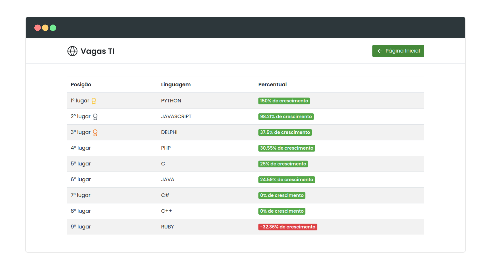

## 💼📊 Vagas TI

Sistema de análise estatística das vagas de emprego na área de programação ofertadas em Fortaleza, Ceará.




## 🔥 Instalação

```bash
yarn install # or npm install
yarn serve # npm run serve
yarn build # or npm run build
```

## 👨‍🚀 Equipe

<table>
  <tr>
    <td align="center">
      <a href="https://github.com/ClodoaldoDantas">
        
        <br />
        <sub><b>Clodoaldo Dantas</b></sub>
      </a>
    </td>
    <td align="center">
      <a href="https://github.com/DavidJuliao">
        
        <br />
        <sub><b>David Julião</b></sub>
      </a>
    </td>
    <td align="center">
      <a href="https://github.com/Anderson-06">
        
        <br />
        <sub><b>Anderson Eduardo</b></sub>
      </a>
    </td>
    <td align="center">
      <a href="https://github.com/mendes-alexandre">
        
        <br />
        <sub><b>Alexandre Mendes</b></sub>
      </a>
    </td>
    <td align="center">
      <a href="https://github.com/PedroLSM">
        
        <br />
        <sub><b>Pedro Lucas</b></sub>
      </a>
    </td>
  </tr>
</table>
